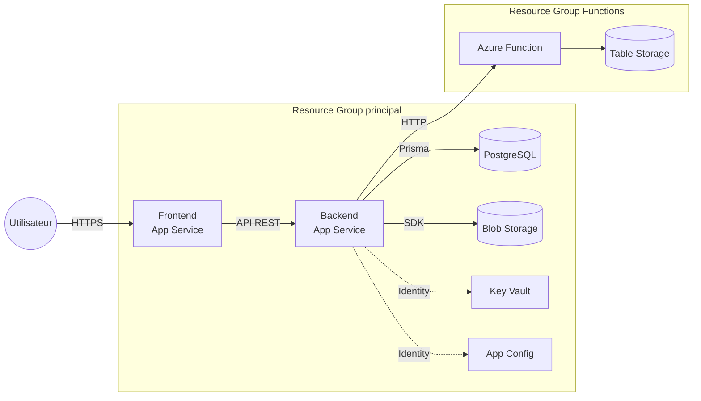
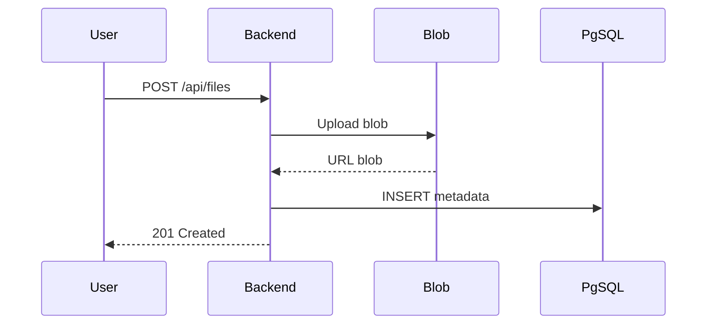
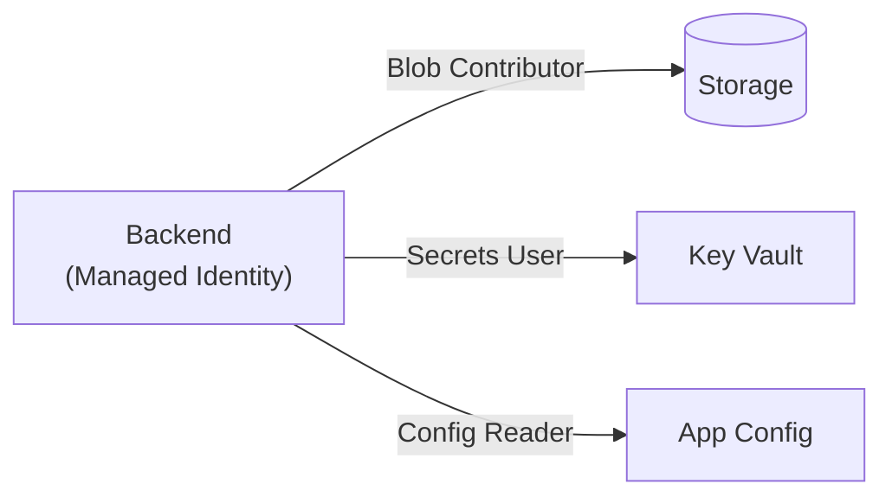
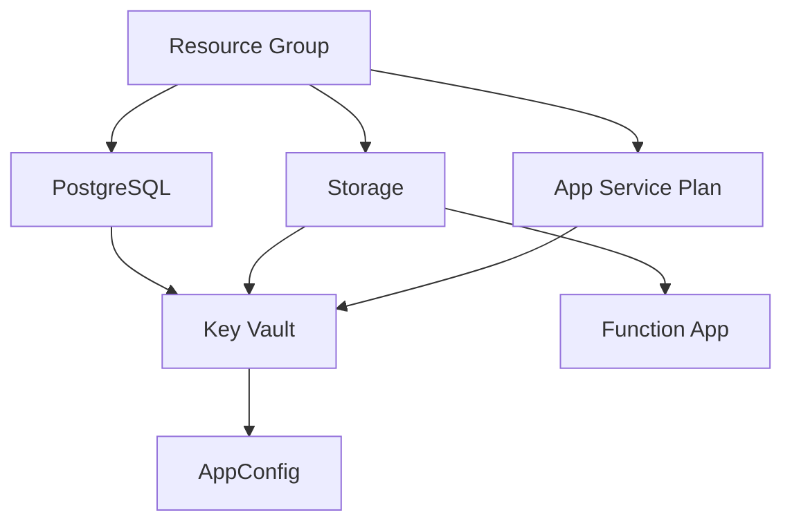
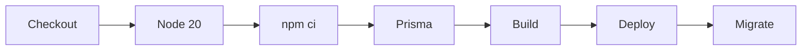
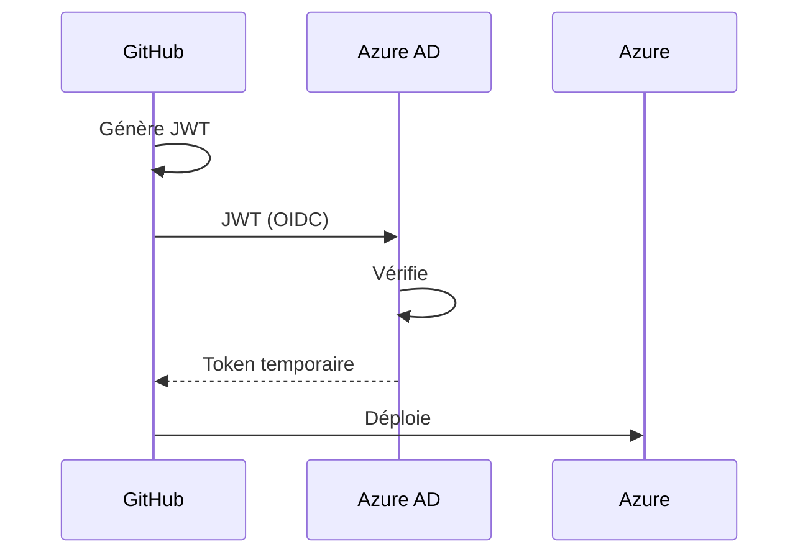

# Cloud Azure
## Application Web 3-Tiers

Déploiement d'une application de gestion de fichiers sur Microsoft Azure

<div class="pt-12">
  <span class="px-2 py-1 rounded" style="background: #0078d4; color: white;">
    Azure App Service · PostgreSQL · Blob Storage · Functions · Key Vault
  </span>
</div>

<div class="abs-br m-6 flex gap-2 text-sm opacity-50">
  MORIN Enzo · PEREIRA Matteo · RUSSEIL Valentin
</div>

---

# Sommaire

<div class="grid grid-cols-2 gap-8 pt-4">

<div>

### Architecture & Cloud

1. Contexte du projet
2. Architecture 3-Tiers
3. Services Azure utilisés
4. Sécurité - Managed Identity

</div>

<div>

### Déploiement & DevOps

5. Infrastructure as Code (Bicep)
6. CI/CD - GitHub Actions + OIDC
7. Azure Functions (FaaS)
8. Estimation des coûts
9. Difficultés rencontrées

</div>

</div>

---
layout: section
---

# 1. Contexte du projet

---

# Objectif du TP

Déployer une **application web complète** sur Microsoft Azure en suivant une **architecture 3-tiers**.

<div class="grid grid-cols-2 gap-8 pt-4">

<div>

### Application

- Gestionnaire de fichiers en ligne
- Upload / téléchargement / visualisation
- Organisation en dossiers hiérarchiques
- Synchronisation temps réel (SSE)
- Logging d'activité

</div>

<div>

### Contraintes Cloud

- Modèle **PaaS** (pas de VM)
- **Infrastructure as Code** avec Bicep
- **CI/CD** automatisé
- **Managed Identity** (pas de credentials dans le code)
- Estimation des coûts

</div>

</div>

---

# Stack technique

<div class="grid grid-cols-3 gap-6 pt-4">

<div class="p-4 rounded-lg" style="background: rgba(0,120,212,0.1); border: 1px solid rgba(0,120,212,0.3);">

### Frontend
- **React 18** + Vite
- TypeScript
- CSS Modules
- SPA avec React Router

</div>

<div class="p-4 rounded-lg" style="background: rgba(0,120,212,0.1); border: 1px solid rgba(0,120,212,0.3);">

### Backend
- **Express.js** + TypeScript
- **Prisma** ORM
- Zod (validation)
- Server-Sent Events

</div>

<div class="p-4 rounded-lg" style="background: rgba(0,120,212,0.1); border: 1px solid rgba(0,120,212,0.3);">

### Cloud Azure
- App Service (PaaS)
- PostgreSQL Flexible Server
- Blob Storage
- Key Vault · App Config
- Azure Functions

</div>

</div>

<div class="pt-6 text-sm opacity-70">

**Pourquoi ce stack ?** React pour l'écosystème mature, Express pour la cohérence TypeScript end-to-end, Azure PaaS pour la simplicité de gestion sans infrastructure à maintenir.

</div>

---
layout: section
---

# 2. Architecture 3-Tiers

---

# Schéma global de l'architecture

<div class="w-full h-full flex items-center justify-center -mt-4">



</div>

---

# Les 3 tiers en détail

| Tier | Service Azure | Technologie | Rôle |
|------|--------------|-------------|------|
| **Présentation** | App Service | React + Vite | Interface utilisateur SPA |
| **Logique métier** | App Service | Express + Prisma | API REST, traitement |
| **Données** | PostgreSQL Flexible Server | PostgreSQL 16 | Persistance relationnelle |
| **Stockage** | Blob Storage | Standard LRS | Fichiers uploadés |
| **FaaS** | Azure Function | Node.js (Consumption) | Logging d'activité |

<div class="pt-4">

### Flux de données

1. L'utilisateur interagit avec le **Frontend** (SPA React)
2. Le Frontend appelle l'**API REST** du Backend via HTTPS
3. Le Backend stocke les métadonnées dans **PostgreSQL**, les fichiers dans **Blob Storage**
4. Les secrets sont récupérés depuis **Key Vault**, la config depuis **App Configuration**
5. Les événements sont envoyés à l'**Azure Function** pour le logging

</div>

---

# Pourquoi PaaS et pas IaaS ?

<div class="grid grid-cols-2 gap-8 pt-4">

<div>

### Alternatives considérées

| Modèle | Service | Verdict |
|--------|---------|---------|
| **PaaS** | App Service | ✅ Choisi |
| CaaS | Container Apps | Trop complexe |
| CaaS | AKS (Kubernetes) | Overkill |
| IaaS | VM Azure | Trop de gestion |

</div>

<div>

### Avantages du PaaS

- **Pas de gestion d'OS** (patches, mises à jour)
- **Scaling automatique** intégré
- **SSL/TLS géré** par Azure
- **Intégration CI/CD** native
- **Slots de déploiement** (blue/green)
- **Coût réduit** vs VM dédiée

</div>

</div>

<div class="pt-4 text-sm p-3 rounded" style="background: rgba(0,120,212,0.1);">

> Azure App Service (B1 Linux) = ~13 €/mois vs VM B1ms = ~15 €/mois + gestion manuelle complète

</div>

---
layout: section
---

# 3. Services Azure utilisés

---

# Vue d'ensemble des ressources

| Service | Ressource | SKU | Rôle |
|---------|-----------|-----|------|
| **Resource Group** | rg-cloudazure-dev | - | Conteneur logique |
| **App Service Plan** | asp-cloudazure-dev | B1 (Basic) | Hébergement apps |
| **Web App** x2 | app-cloudazure-*-dev | - | Frontend + Backend |
| **PostgreSQL** | psql-cloudazure-dev | Burstable B1ms | BDD relationnelle |
| **Storage Account** | stcloudazuredev | Standard LRS | Blob Storage |
| **Key Vault** | kv-cloudazure-dev | Standard | Secrets |
| **App Configuration** | appcs-cloudazure-dev | Free | Config centralisée |
| **Function App** | func-cloudazure-logging-dev | Consumption Y1 | FaaS logging |

<div class="pt-2 text-sm opacity-70">

Toutes les ressources suivent la convention de nommage Azure : `{type}-{projet}-{role}-{env}`

</div>

---

# Azure Blob Storage

Stockage des fichiers uploadés par les utilisateurs.

<div class="grid grid-cols-2 gap-8 pt-4">

<div>

### Configuration
- **SKU** : Standard LRS (Locally Redundant)
- **Container** : `uploads`
- **Accès** : via Managed Identity
- **Rôle RBAC** : Storage Blob Data Contributor

### Pourquoi LRS ?
- Environnement de dev, pas besoin de réplication géographique
- -40% de coût vs GRS
- En prod : passage en GRS pour la résilience

</div>

<div>

### Flux d'upload



</div>

</div>

---

# Azure Key Vault & App Configuration

<div class="grid grid-cols-2 gap-8 pt-4">

<div>

### Key Vault (Secrets)

- Stockage sécurisé du `DATABASE_URL`
- **Aucun secret dans le code** ni dans les variables d'environnement en clair
- Accès via **Managed Identity** uniquement
- Rôle : `Key Vault Secrets User`

```
Backend App Service
    → Managed Identity
        → Key Vault
            → DATABASE_URL (secret)
```

</div>

<div>

### App Configuration (Settings)

- Configuration centralisée (container name, etc.)
- **Free tier** (< 1000 requêtes/jour)
- Accès via **Managed Identity**
- Rôle : `App Configuration Data Reader`

### Avantage
- Modifier la config **sans redéployer**
- Séparation config / code / secrets
- Un seul point de gestion

</div>

</div>

---
layout: section
---

# 4. Sécurité - Managed Identity

---

# System-Assigned Managed Identity

**Principe** : chaque App Service possède une identité Azure, éliminant le besoin de stocker des credentials.



<div class="text-sm">

| Ressource | Rôle RBAC | Usage |
|-----------|-----------|-------|
| Storage | Storage Blob Data Contributor | Upload/download/delete |
| Key Vault | Key Vault Secrets User | Lecture secrets |
| App Config | App Configuration Data Reader | Lecture paramètres |

</div>

<div class="text-sm p-2 rounded" style="background: rgba(255,193,7,0.1); border-left: 3px solid #ffc107;">

**Zero secret dans le code** : tout passe par Managed Identity + RBAC.

</div>

---
layout: section
---

# 5. Infrastructure as Code (Bicep)

---

# Structure modulaire Bicep

```
infra/
├── main.bicep                 # Orchestration (scope: subscription)
├── modules/
│   ├── appservice.bicep       # App Service Plan + 2 Web Apps
│   ├── database.bicep         # PostgreSQL Flexible Server
│   ├── storage.bicep          # Storage Account + Container Blob
│   ├── keyvault.bicep         # Key Vault + Secrets + RBAC
│   ├── appconfig.bicep        # App Configuration + Settings
│   └── functionapp.bicep      # Function App (Consumption)
└── parameters/
    ├── dev.bicepparam          # Paramètres développement
    └── prod.bicepparam         # Paramètres production
```

### Principes appliqués

- **Modularité** : 1 module = 1 service Azure
- **Paramétrage** : fichiers `.bicepparam` séparés par environnement
- **Secrets sécurisés** : `readEnvironmentVariable()` dans les paramètres
- **Dépendances** : gérées via outputs/inputs entre modules

---

# Bicep - Orchestration

Le fichier `main.bicep` orchestre le déploiement de toute l'infrastructure.

<div class="grid grid-cols-2 gap-6 pt-2">

<div>

### Chaîne de dépendances



</div>

<div>

### Commande de déploiement

```bash
az deployment sub create \
  --location swedencentral \
  --template-file infra/main.bicep \
  --parameters infra/parameters/dev.bicepparam \
  --parameters dbAdminPassword='***'
```

### Pourquoi Bicep ?

- Imposé pour le TP
- Natif Azure (vs Terraform)
- Syntaxe déclarative claire
- Validation intégrée
- Support IntelliSense dans VS Code

</div>

</div>

---
layout: section
---

# 6. CI/CD - GitHub Actions + OIDC

---

# 4 Workflows GitHub Actions

```
.github/workflows/
├── deploy-infra.yml       # Infrastructure Bicep
├── deploy-backend.yml     # Backend Express
├── deploy-frontend.yml    # Frontend React
└── deploy-functions.yml   # Azure Function
```

<div class="grid grid-cols-2 gap-6 pt-4">

<div>

### Déclenchement automatique

| Dossier modifié | Workflow |
|-----------------|----------|
| `infra/**` | deploy-infra |
| `backend/**` | deploy-backend |
| `frontend/**` | deploy-frontend |
| `functions/**` | deploy-functions |

</div>

<div>

### Pipeline Backend (exemple)



</div>

</div>

---

# Authentification OIDC

**OpenID Connect** avec Workload Identity Federation : **aucun secret de longue durée** stocké dans GitHub.

<div class="grid grid-cols-2 gap-8 pt-4">

<div>

### Comment ca marche ?



</div>

<div>

### OIDC vs Publish Profile

<div class="text-sm">

| Aspect | Publish Profile | OIDC |
|--------|----------------|------|
| Credentials | Statiques | Temporaires |
| Sécurité | Fuite = accès total | Aucun secret |
| Rotation | Manuelle | Automatique |
| Microsoft | Ancienne méthode | Recommandé |

</div>

</div>

</div>

<div class="text-sm p-2 rounded" style="background: rgba(76,175,80,0.1); border-left: 3px solid #4CAF50;">

Les `CLIENT_ID`, `TENANT_ID`, `SUBSCRIPTION_ID` sont des identifiants **publics**, pas des secrets.

</div>

---
layout: section
---

# 7. Azure Functions (FaaS)

---

# Azure Function - Logging d'activité

<div class="grid grid-cols-2 gap-8 text-sm">

<div>

### 3 fonctions

| Fonction | Trigger | Rôle |
|----------|---------|------|
| `logActivity` | HTTP POST | Enregistre un événement |
| `getLogs` | HTTP GET | Récupère avec filtres |
| `cleanupLogs` | Timer CRON | Purge > 30 jours |

### Pourquoi une Function ?

- **Découplage** : logging indépendant de l'API
- **Consumption Plan** : paiement à l'usage
- **Scaling indépendant** du backend
- **Resource Group séparé**

</div>

<div>

### Stockage : Azure Table Storage

- Partitionné par **date** (YYYY-MM-DD)
- Requêtes optimisées par PartitionKey
- Coût quasi nul en dev

### Événements loggés

`upload` · `download` · `view` · `delete` · `file_moved` · `folder_created` · `folder_deleted` · `folder_renamed` · `folder_moved` · `error`

</div>

</div>

---
layout: section
---

# 8. Estimation des coûts

---

# Coûts - Dev vs Production

<div class="grid grid-cols-2 gap-6 text-sm">

<div>

### Dev (~30 €/mois)

| Service | SKU | Coût |
|---------|-----|------|
| App Service | B1 | ~13 € |
| PostgreSQL | Burstable B1ms | ~15 € |
| Storage | Standard LRS | ~1 € |
| Key Vault / App Config | Standard / Free | ~0 € |
| Function App | Consumption | ~0 € |
| **Total** | | **~30 €** |

</div>

<div>

### Prod (~375 €/mois)

| Service | SKU | Coût |
|---------|-----|------|
| App Service | S1 Standard | ~70 € |
| PostgreSQL | GP D2s | ~120 € |
| Storage | Standard GRS | ~5 € |
| Function App | Premium EP1 | ~150 € |
| App Gateway | Standard | ~30 € |
| **Total** | | **~375 €** |

</div>

</div>

<div class="text-xs pt-2">

**Optimisations** : PostgreSQL Burstable (-50%) · Storage LRS (-40%) · App Config Free · Consumption Plan · Sweden Central

</div>

---
layout: section
---

# 9. Difficultés rencontrées

---

# Problèmes et solutions

<div class="grid grid-cols-2 gap-6 pt-2 text-sm">

<div>

### Managed Identity & RBAC
- **Problème** : 403 Forbidden sur le Storage
- **Cause** : Role assignments manquants dans Bicep
- **Solution** : Ajout des role assignments RBAC dans les modules

### PostgreSQL Firewall
- **Problème** : Timeout Prisma
- **Cause** : Connexions bloquées par défaut
- **Solution** : Firewall rule `AllowAllAzureServices`

### Secrets Bicep en CI/CD
- **Problème** : Passer le mot de passe DB sans l'exposer
- **Solution** : `readEnvironmentVariable()` dans `.bicepparam`

### Blob Public Access
- **Problème** : Blocage du visionnement des fichiers
- **Solution** : `AllowBlobPublicAccess = true`

</div>

<div>

### CORS Frontend/Backend
- **Problème** : Erreurs CORS entre les 2 App Services
- **Solution** : Configuration CORS dynamique dans Express avec `FRONTEND_URL`

### Prisma sur App Service
- **Problème** : `@prisma/client did not initialize`
- **Solution** : `prisma generate` explicite dans le pipeline CI/CD

### SPA Routes en production
- **Problème** : 404 sur les routes directes React
- **Solution** : Nginx avec `try_files $uri /index.html`

### Cold Start Azure Function
- **Problème** : Latence au premier appel
- **Cause** : Plan Consumption met en veille
- **Solution** : Accepté en dev, Premium Plan en prod

</div>

</div>

---

# Démo

<div class="text-sm">

| Composant | URL |
|-----------|-----|
| **Frontend** | `app-cloudazure-frontend-dev.azurewebsites.net` |
| **Backend API** | `app-cloudazure-backend-dev.azurewebsites.net` |
| **Azure Function** | `func-cloudazure-logging-dev.azurewebsites.net` |
| **Logs** | `app-cloudazure-frontend-dev.azurewebsites.net/logs` |

</div>

### Fonctionnalités

- Upload / téléchargement / visualisation inline (images, PDF, texte)
- Gestion de dossiers hiérarchiques
- Synchronisation temps réel via SSE
- Logging d'activité avec page `/logs`

---
layout: center
class: text-center
---

# Merci

### Questions ?

<div class="pt-8 opacity-50 text-sm">
MORIN Enzo · PEREIRA Matteo · RUSSEIL Valentin
</div>
