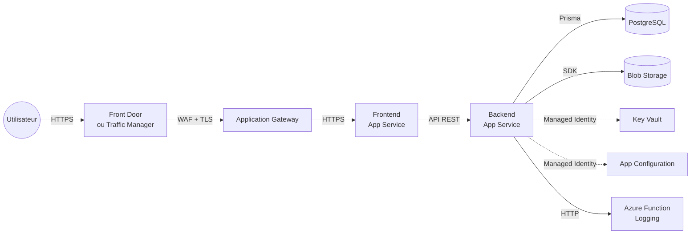
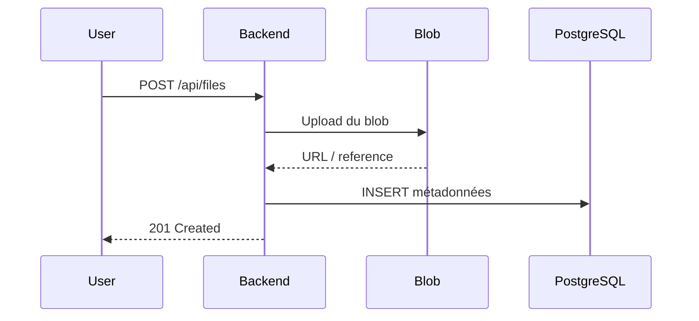

# Cloud Azure
## Application Web 3-Tiers

Déploiement d'une application de gestion de fichiers sur Microsoft Azure

<div class="pt-12">
  <span class="px-2 py-1 rounded" style="background: #0078d4; color: white;">
    App Service · PostgreSQL · Blob Storage · Key Vault · CI/CD
  </span>
</div>

<div class="abs-br m-6 flex gap-2 text-sm opacity-50">
  MORIN Enzo · PEREIRA Matteo · RUSSEIL Valentin
</div>

---

# Sommaire

1. Contexte et objectif
2. Technologies utilisées
3. Architecture 3-tiers et services Azure
4. Choix de déploiement : PaaS vs CaaS
5. Infrastructure as Code (Bicep)
6. CI/CD et sécurité (OIDC, Key Vault, App Config)
7. Upload Blob Storage
8. Sécurité avancée, monitoring et health checks
9. Difficultés et solutions
10. Coûts détaillés + démo live

---

# Objectif du projet

<div class="grid grid-cols-2 gap-8 pt-4 text-left">

<div>

### Ce que fait l'application

- Gestion de fichiers en ligne
- Upload, téléchargement, visualisation
- Organisation en dossiers
- Synchronisation en temps réel

</div>

<div>

### Contraintes du TP

- Architecture 3-tiers sur Azure
- Modèle PaaS prioritaire
- IaC avec Bicep
- CI/CD automatisé
- Gestion sécurisée des secrets

</div>

</div>

---

# Technologies utilisées

<div class="grid grid-cols-3 gap-6 pt-2 text-left text-sm">

<div class="p-3 rounded" style="background: rgba(0,120,212,0.08); border: 1px solid rgba(0,120,212,0.25);">

### Frontend

- React 18 + Vite
- TypeScript
- React Router
- SSE côté client

</div>

<div class="p-3 rounded" style="background: rgba(0,120,212,0.08); border: 1px solid rgba(0,120,212,0.25);">

### Backend

- Express.js + TypeScript
- Prisma ORM
- Zod (validation)
- API REST + SSE

</div>

<div class="p-3 rounded" style="background: rgba(0,120,212,0.08); border: 1px solid rgba(0,120,212,0.25);">

### Cloud et DevOps

- Azure App Service
- PostgreSQL + Blob Storage
- Key Vault + App Config
- Microsoft Entra ID (OAuth 2.0)
- Bicep + GitHub Actions + OIDC

</div>

</div>

<div class="pt-4 text-sm opacity-80">
Objectif: une stack simple à maintenir, cohérente en TypeScript de bout en bout.
</div>

---

# Architecture 3-tiers déployée



<div class="pt-3 text-sm opacity-80">
Trafic entrant sécurisé (WAF) et scalabilité horizontale sur App Service.
</div>

---

# Pourquoi PaaS plutôt que CaaS

| Critère | PaaS (choisi) | CaaS |
|---|---|---|
| Mise en place | Rapide | Plus complexe |
| Exploitation | Faible charge ops | Plus de supervision |
| Scaling | Intégré | À configurer finement |
| Coût en dev | Maîtrisé | Souvent plus élevé |

<div class="pt-4 text-sm p-3 rounded" style="background: rgba(0,120,212,0.1);">
Choix du groupe : App Service pour livrer vite, avec une complexité opérationnelle réduite.
</div>

---

# Services Azure utilisés


| Besoin | Service Azure | Rôle |
|---|---|---|
| Authentification | Microsoft Entra ID (OAuth 2.0) | Connexion sécurisée |
| Frontend + Backend | App Service | Hébergement web |
| Données relationnelles | PostgreSQL Flexible Server | Métadonnées fichiers |
| Fichiers | Storage Account (Blob) | Upload/download |
| Secrets | Key Vault | DATABASE_URL et secrets |

---

# Services Azure utilisés 


| Besoin | Service Azure | Rôle |
|---|---|---|
| Configuration | App Configuration | Paramètres centralisés |
| Entrée sécurisée | Application Gateway + WAF | Filtrage et protection HTTP(S) |
| Haute disponibilité (bonus) | Front Door / Traffic Manager | Failover multi-région |
| Monitoring | Azure Monitor + Alerts | Dashboard et alertes |
| Logging optionnel | Azure Functions + Table Storage | Journalisation |

---

# Upload des fichiers via Blob Storage



  Points clés : séparation fichier/métadonnées, performance, scalabilité.

---

# Secrets, config et Managed Identity

<div class="grid grid-cols-2 gap-8 pt-2 text-left">

<div>

### Key Vault + App Configuration

- Secrets dans Key Vault
- Config applicative dans App Configuration
- Aucun secret en dur dans le code
- OAuth 2.0 via Entra ID pour l'authentification

</div>

<div>

### Accès par identité gérée

| Ressource | Rôle RBAC |
|---|---|
| Blob Storage | Storage Blob Data Contributor |
| Key Vault | Key Vault Secrets User |
| App Configuration | App Configuration Data Reader |

</div>

</div>

---

# Infrastructure as Code - Bicep

```text
infra/
├── main.bicep
├── modules/
│   ├── appservice.bicep
│   ├── database.bicep
│   ├── storage.bicep
│   ├── keyvault.bicep
│   ├── appconfig.bicep
│   └── functionapp.bicep
└── parameters/
    ├── dev.bicepparam
    └── prod.bicepparam
```

- 1 module = 1 service
- Paramétrage par environnement
- Dépendances gérées entre modules

---

# CI/CD GitHub Actions + OIDC

<div class="grid grid-cols-2 gap-8 text-left">

<div>

### Pipelines

- `deploy-infra.yml`
- `deploy-backend.yml`
- `deploy-frontend.yml`
- `deploy-functions.yml`

Etapes type : checkout -> install -> build -> deploy -> migrate.

</div>

<div>

### OIDC

- Pas de secret long terme dans GitHub
- Token temporaire émis à chaque run
- Méthode recommandée par Microsoft

</div>

</div>

---

# Sécurité avancée, monitoring et health checks

| Élément | Détail de mise en oeuvre | Statut |
|---|---|---|
| Monitoring avancé | Azure Monitor avec alertes (temps de réponse > 2s, taux d'erreur > 5%) + dashboard | Réalisé |
| Custom WAF rules | Règles WAF personnalisées: rate limiting, geo-filtering, blocage d'IP | Réalisé |
| Health endpoints | Endpoint `/health` (BDD + Storage) utilisé par les health probes App Gateway | Réalisé |

<div class="pt-3 text-sm p-3 rounded" style="background: rgba(0,120,212,0.1);">
Bonus optionnel réalisé : déploiement multi-région (2 régions Azure) avec failover via Front Door / Traffic Manager.
</div>

<div class="pt-3 text-sm opacity-80">
Résultat : sécurité renforcée du trafic entrant, détection proactive des incidents et meilleure résilience.
</div>

---

# Difficultés rencontrées et solutions

| Problème | Cause | Solution |
|---|---|---|
| 403 sur Blob | RBAC incomplet | Rôle assignments ajoutés |
| Timeout Prisma | Firewall PostgreSQL | Règle Azure adaptée |
| CORS FE/BE | Origines non autorisées | CORS dynamique via `FRONTEND_URL` |
| Prisma client en prod | Génération manquante | `prisma generate` en CI/CD |

---

# Estimation des coûts détaillée

<div class="grid grid-cols-2 gap-8 text-sm text-left">

<div>

| Service | Dev | Prod |
|---|---:|---:|
| App Service | ~13 EUR | ~70 EUR |
| PostgreSQL Flexible | ~15 EUR | ~120 EUR |
| Blob Storage | ~1 EUR | ~5 EUR |
| Key Vault + App Config | ~0 EUR | ~0-3 EUR |
| Azure Function | ~0 EUR | ~150 EUR |
| App Gateway | - | ~30 EUR |
| **Total** | **~30 EUR** | **~375 EUR** |

</div>

<div>

### Postes les plus chers en production

- Azure Function Premium: ~40% du total
- PostgreSQL Flexible: ~32% du total
- App Service Plan: ~19% du total

### Lecture rapide

- Le passage Function Consumption -> Premium est le principal facteur de hausse.
- PostgreSQL devient le deuxième poste de dépense.
- Blob Storage reste marginal dans le budget global.
- Le déploiement multi-région (bonus optionnel) augmente le coût, mais améliore la disponibilité.

</div>

</div>

---

# Démo live

### Scénario (3 minutes)

1. Upload d'un fichier
2. Création/déplacement dans un dossier
3. Visualisation du fichier
4. Vérification des logs

---
layout: center
class: text-center
---

# Merci

### Questions ?

<div class="pt-8 opacity-50 text-sm">
MORIN Enzo · PEREIRA Matteo · RUSSEIL Valentin
</div>